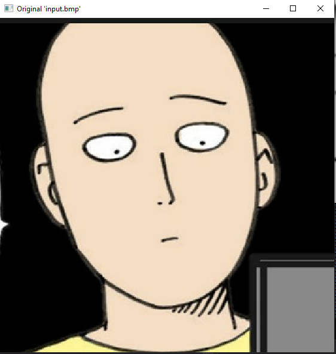
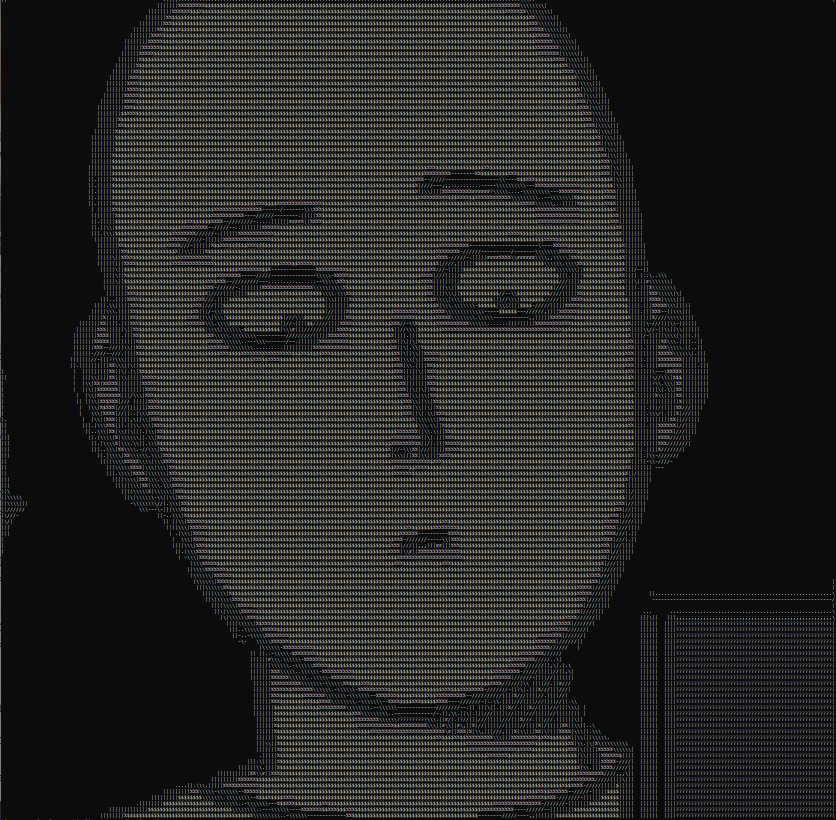
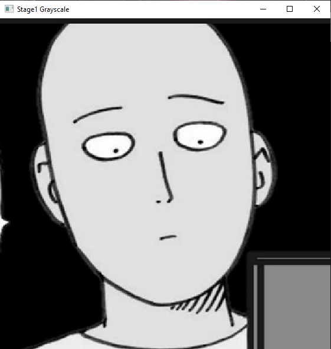
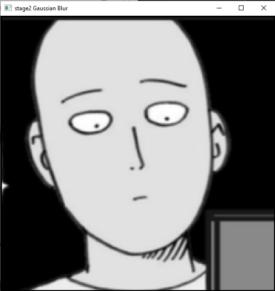
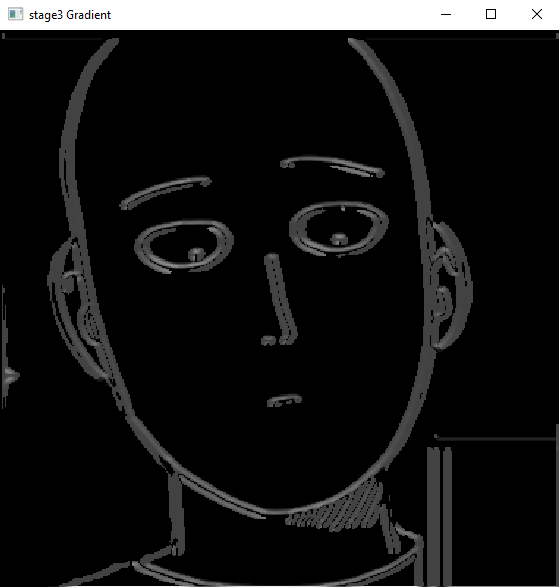

# ASCII-Art
 A teasing program that reads png and display in console window

 
 Input
 
  

  
 Output
 
  
  
  
 step 1: Gray Scale
  
  
 step 2: Gaussian Blur
  
  
 step 3: Gradient (find edge direction)
  

 Output (edge only) 
  
  
   
